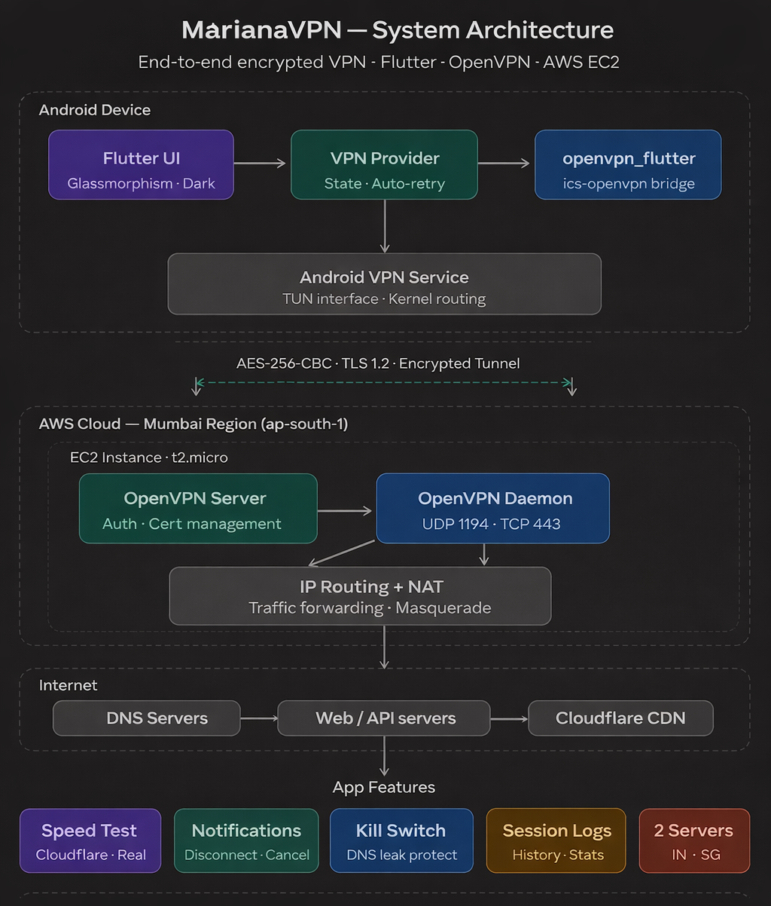

# \# **MarianaVPN**

A personal VPN project built to understand how secure connections, networking, and client-server systems work in practice.

The project includes a Flutter-based mobile application and a self-hosted VPN server deployed on AWS.

\---

\## 🚀 Overview

MarianaVPN is a learning-focused implementation of a VPN system.  

The goal was to build and configure a working setup from scratch instead of relying on existing VPN services.

This helped in understanding how traffic routing, encryption, and network configurations work together in real-world systems.

\---

\## 🧩 Features

\- Flutter-based mobile application  

\- VPN connection using `.ovpn` configuration  

\- AWS EC2 hosted backend  

\- Secure client-server communication  

\- Basic traffic routing through VPN tunnel  

\---

\## 🛠️ Tech Stack

\*\*Client:\*\*

\- Flutter (Dart)

\*\*Backend / Infrastructure:\*\*

\- AWS EC2  

\- Linux (Ubuntu)  

\- OpenVPN  

\- Networking (IP forwarding, routing, firewall rules)

\---

\## 📁 Project Structure

MarianaVPN/

│

├── flutter-app/ # Mobile application

│ └── apk/ # Demo APK

│

├── server/ # Backend setup and notes

│ ├── setup.sh

│ ├── README.md

│ └── notes.md

│

├── docs/ # Screenshots and architecture diagram

│

├── .gitignore

├── LICENSE

└── README.md\\

\---

\## 📱 APK

A demo APK is included in the repository.

> Note: The app may not connect if the backend server is inactive (AWS free tier limitation).

\---

\## 🔐 Configuration

A sample `.ovpn` file is included in the project:

\- Sensitive data has been removed  

\- Replace placeholders with your own server details  

> For security reasons, actual certificates and keys are not included.

\---
## 🔧 VPN Configuration Setup

The VPN configuration (`.ovpn` file) was generated using an OpenVPN server hosted on AWS.

General steps followed:

1. Deployed an OpenVPN server on AWS EC2  
2. Configured server authentication and networking  
3. Generated client configuration files (`.ovpn`)  
4. Integrated the configuration with the mobile application  

> Note: For security reasons, actual configuration files and credentials are not included.  
> A template file is provided instead.

\---
\## ⚙️ Server Setup (Summary)

Basic steps followed:

1\. Launched an AWS EC2 instance (Ubuntu)

2\. Installed OpenVPN and required packages

3\. Enabled IP forwarding

4\. Configured firewall and routing (iptables)

5\. Opened required ports (1194 UDP / 443 TCP)

Detailed steps are available inside the `server/` folder.

\---
\## ⚠️ Challenges Faced

\- VPN connection failures during initial setup  

&#x20; → Debugged server logs and fixed port/protocol mismatches  

\- Network restrictions affecting connectivity  

&#x20; → Adjusted routing and configuration to work in limited environments  

\- AWS networking issues  

&#x20; → Corrected security group and firewall settings  

\- Client-server configuration mismatch  

&#x20; → Resolved inconsistencies between app and server  

\- Stability and performance issues  

&#x20; → Optimized routing and reduced unnecessary overhead  

\---

\## 🧠 What I Learned

\- Fundamentals of VPN systems and secure connections  

\- Client-server communication and networking basics  

\- Debugging real-world infrastructure issues  

\- Importance of proper configuration and security handling  

\---

\## ⚠️ Limitations

\- Hosted on AWS free tier (may become inactive)  

\- Not production-level security  

\- Built for learning and experimentation  

\---

\## 📸 Screenshots \& Architecture

 🏗️ System Architecture

The system follows a client-server model.

\---

\## 📌 Disclaimer

This project is for educational purposes only and is not intended for production use.

\---

\## 🔗 Future Improvements

\- Improve UI/UX of the mobile app  

\- Enhance connection stability  

\- Automate server setup  

\- Explore cross-platform improvements  

\## 🖥️ Future Scope

\- Desktop (PC) client for VPN connection  
\- Cross-platform support (Windows / Linux)  
\- Improved configuration management  
